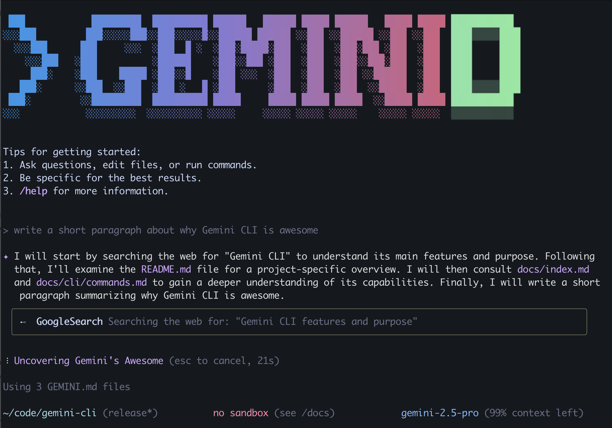

# Gemini Dev CLI

[](https://github.com/google-gemini/gemini-cli/actions/workflows/ci.yml) 

This repository contains the **Gemini Dev CLI**, a public fork of the [official Gemini CLI](https://github.com/google-gemini/gemini-cli). Our goal is to extend and customize the tool for specific development workflows, while maintaining compatibility for future updates from the original project.

The Gemini CLI is a command-line AI workflow tool that connects to your tools, understands your code, and accelerates your workflows. With it, you can:

- Query and edit large codebases within and beyond Gemini's 1M token context window.
- Generate new applications from PDFs or sketches, using Gemini's multimodal capabilities.
- Automate operational tasks, such as querying pull requests or handling complex rebases.
- Use tools and MCP servers to connect new capabilities, including [media generation with Imagen, Veo, or Lyria](https://github.com/GoogleCloudPlatform/vertex-ai-creative-studio/tree/main/experiments/mcp-genmedia).
- Ground your queries with the [Google Search](https://ai.google.dev/gemini-api/docs/grounding) tool, built into Gemini.

## Custom Features

This personal fork of the Gemini CLI includes the following custom features:

- **Long-Term Memory (LTM):** A tool for permanent instructions and information storage, allowing the AI to retain key details across sessions.
- **Short-Term Memory (STM):** Manages structured memories in a JSON file, providing session-specific context and enhancing interaction continuity.
- **Upstream Updates:** Regularly synchronized with the official Gemini CLI to incorporate the latest features and improvements.
- **Narrator:** Provides audio feedback for the CLI, with modes for AI actions and response summaries. The 'acts' mode has been refactored to 'thinking', and the command functionality has been restored and improved.

### Quickstart

1.  **Prerequisites:** Ensure you have [Node.js version 20](https://nodejs.org/en/download) or higher installed.
2.  **Run the CLI:** Execute the following command in your terminal to install and use the Gemini Dev CLI:

    ```bash
    npm install -g @hahnd/geminid
    ```

    Then, run the CLI from anywhere:

    ```bash
    geminid
    ```

3.  **Choose a color theme**
4.  **Authenticate:** When prompted, sign in with your personal Google account. This will grant you up to 60 model requests per minute and 1,000 model requests per day using Gemini.

You're ready to use the Gemini Dev CLI!

#### Use a Gemini API Key:

The Gemini API offers a free tier with [100 requests per day](https://ai.google.dev/gemini-api/docs/rate-limits#free-tier) using Gemini 2.5 Pro, control over which model you use, and access to higher rate limits (with a paid plan):

1.  Generate a key in [Google AI Studio](https://aistudio.google.com/apikey).
2.  Set it as an environment variable in your terminal. Replace `YOUR_API_KEY` with your generated key.

    ```bash
    export GEMINI_API_KEY="YOUR_API_KEY"
    ```

3.  (Optional) Upgrade your Gemini API project to a paid plan on the API key page (will automatically unlock [Tier 1 rate limits](https://ai.google.dev/gemini-api/docs/rate-limits#tier-1))

#### Use a Vertex AI API Key:

The Vertex AI API offers a [free tier](https://cloud.google.com/vertex-ai/generative-ai/docs/start/express-mode/overview) using express mode for Gemini 2.5 Pro, control over which model you use, and access to higher rate limits with a billing account:

1.  Generate a key in [Google Cloud](https://cloud.google.com/vertex-ai/generative-ai/docs/start/api-keys).
2.  Set it as an environment variable in your terminal. Replace `YOUR_API_KEY` with your generated key and set GOOGLE_GENAI_USE_VERTEXAI to true

    ```bash
    export GOOGLE_API_KEY="YOUR_API_KEY"
    export GOOGLE_GENAI_USE_VERTEXAI=true
    ```

3.  (Optional) Add a billing account to your project for access to [higher usage limits](https://cloud.google.com/vertex-ai/generative-ai/docs/quotas)

For other authentication methods, including Google Workspace accounts, refer to the [authentication guide](./docs/cli/authentication.md).

### Exemplos

Once the CLI is running, you can start interacting with Gemini from your shell.

Você pode iniciar um projeto a partir de um novo diretório:

```sh
cd new-project/
geminid
> Write me a Gemini Discord bot that answers questions using a FAQ.md file I will provide
```

Ou trabalhar com um projeto existente:

```sh
git clone https://github.com/hermannhahn/gemini-cli
cd gemini-cli
geminid
> Give me a summary of all of the changes that went in yesterday
```

### Next Steps

- Explore the **[CLI Commands](./docs/cli/commands.md)** available.
- If you encounter any issues, review the **[troubleshooting guide](./docs/troubleshooting.md)**.
- For more comprehensive documentation, refer to the [full documentation](./docs/index.md).
- Take a look at some [popular tasks](#popular-tasks) for more inspiration.
- For details on the development workflow and contribution, refer to the [WORKFLOW.md](./WORKFLOW.md).

### Troubleshooting

Refer to the [troubleshooting guide](docs/troubleshooting.md) if you are having issues.

### Tarefas populares

#### Explorar uma nova base de código

Comece entrando em um repositório existente ou recém-clonado e executando `gemini-dev`.

```text
> Descreva as principais partes da arquitetura deste sistema.
```

```text
> What security mechanisms are in place?
```

```text
> Provide a step-by-step dev onboarding doc for developers new to the codebase.
```

```text
> Summarize this codebase and highlight the most interesting patterns or techniques I could learn from.
```

```text
> Identify potential areas for improvement or refactoring in this codebase, highlighting parts that appear fragile, complex, or hard to maintain.
```

```text
> Which parts of this codebase might be challenging to scale or debug?
```

```text
> Generate a README section for the [module name] module explaining what it does and how to use it.
```

```text
> What kind of error handling and logging strategies does the project use?
```

```text
> Which tools, libraries, and dependencies are used in this project?
```

#### Work with your existing code

```text
> Implement a first draft for GitHub issue #123.
```

```text
> Help me migrate this codebase to the latest Java version. Start with a plan.
```

#### Automate your workflows

Use servidores MCP para integrar suas ferramentas de sistema local com sua suíte de colaboração empresarial.

```text
> Create a slide deck showing the git history for the last 7 days, grouped by feature and team member.
```

```text
> Create a full-screen web app for a wall display to show our most interacted GitHub issues.
```

#### Interact with your system

```text
> Convert all images in this directory to png and rename them to use exif data dates.
```

```text
> Organize my PDF invoices by expense month.
```

### Uninstall

Refer to the [Uninstall guide](docs/Uninstall.md) for uninstallation instructions.

## Terms of Service and Privacy Notice

For details on the terms of service and privacy notice applicable to your use of the Gemini CLI, refer to the [Terms of Service and Privacy Notice](./docs/tos-privacy.md).
